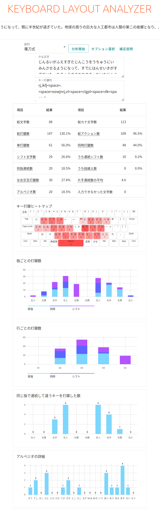

# 日本語キー配列アナライザー

## 目的

すでに英文を対象にしたキーボードのキー配列分析ソフトとしてはいくつかあって、例えば[Keyboard Layout Analyzer](http://patorjk.com/keyboard-layout-analyzer/#/main)や[QMK Keymap Carpalx Analyser](https://jackhumbert.github.io/typing_model/)などがあります。
しかし、これらは英文を対象としており、日本語で試そうとするとローマ字に変換する方法もありますが、新下駄や薙刀式のようにローマ字ではないカナ入力方式を分析しようとすると、かなり手間がかかることになります。
そこで、英文同様の操作で日本語の文章をキーボードで入力する労力を分析し、またローマ字入力だけではなく、より先進的なカナ入力方式を分析して、よりよい入力方式を創造していく一助になるべく、日本語キー配列アナライザーを作って行くのが、このプロジェクトの目的です。

## 詳細

現時点では一般的な日本語配列キーボードでローマ字入力する場合の定義をjis_romaji.jsonで定義しています。

`layout`はキーボードの各行にあるキーの数を定義しています。

`keys`はキーボードの右上から順に各キーを定義しています。sizeはキーの幅で単位はUです。
fingerはそのキーを何指で押すかを示しており、左小指から右小指に向かって順に0, 1, 2と番号をふっています。
どの指でキーを押すかは個人差があるところですので、定義ファイルを自分に合わせて書き換えてください。
`layout`と`keys`を定義することで、OrtholinearやUSキーボードなどの定義をすることができますが、column staggeredのように縦にずれた配列は表現できません。

`conversion`は文字を入力するのにどのように入力するかを定義します。単にキーをおすだけか、シフトキーを押しながら、ローマ字のように2キーを連続して押すのか、を定義します。
`keys`に定義しても`shift`に定義しても押下頻度の計算は同じですが、追って連続シフト率などを計算したいので、別にしています。
`type`はローマ字のように連続して打鍵するのか、親指シフトのように同時に打鍵するのかを定義します。

## 謝辞

漢字まじりの文章をカナ文字に変換するために[kuromoji.js](https://github.com/takuyaa/kuromoji.js)を使用させていただいています。

